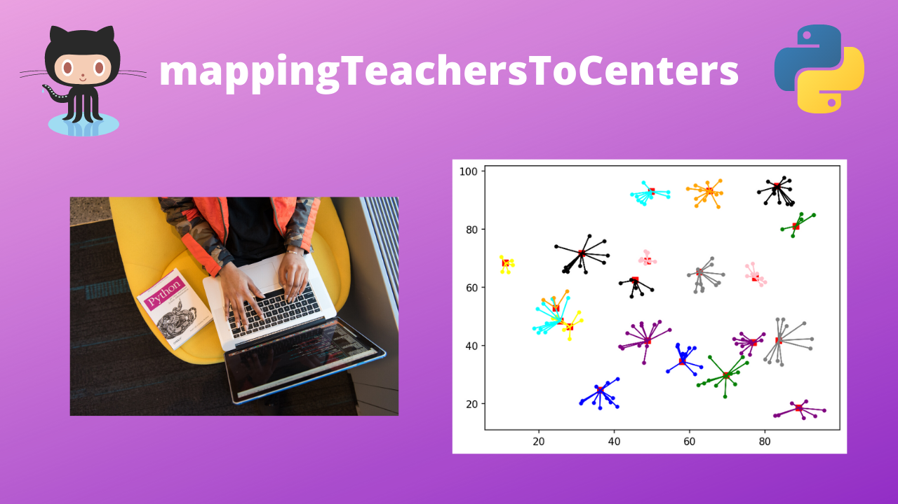
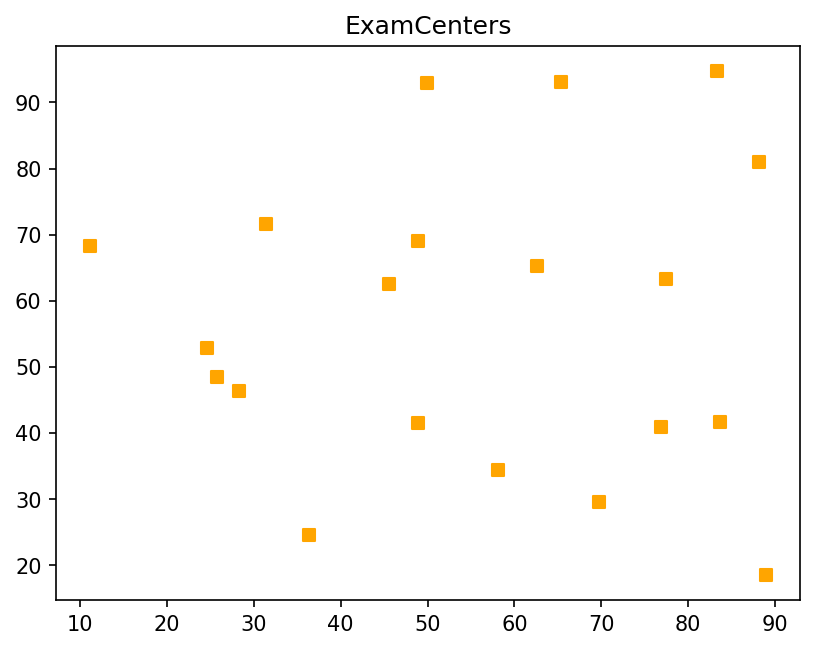
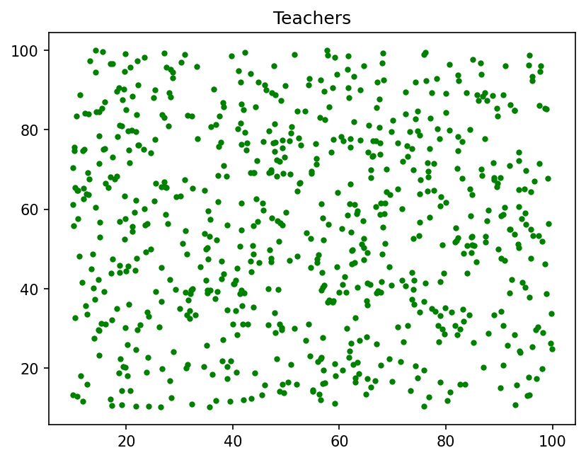
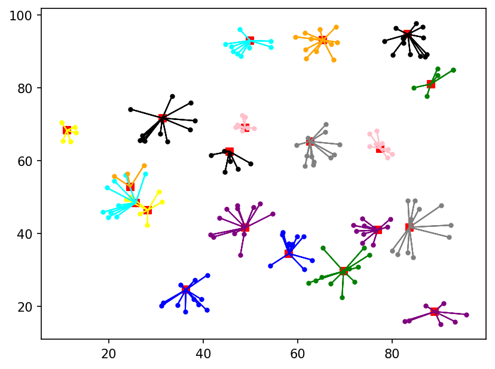

# mapTeachersToCenters

**Mapping Teachers to nearest Exam Centers and simultaneosly making sure that all the Vacancies(Requirements) of each Center is fulfilled**

[Watch Trailer](https://youtu.be/N4-TRZT72bo)

---

## Sample Input of Exam Centers

[Click Here](https://github.com/aahnik/mapTeachersToCenters/blob/master/results/ExamCenters.txt) to view full tabulated data and vacancies in each center 

## Sample Input of Teachers 
(total number of teachers is about 4 times the total required vacancy in exam Centers)

[Click Here](https://github.com/aahnik/mapTeachersToCenters/blob/master/results/Teachers.txt) to view full tabulated data for each teacher

## Output: Connections/Mappings generated by the Algorithm v2.0

_**Any Suggestions / Ideas How to improve the Algorithm ??**_

[Contact me](https://t.me/AahniKDaw)

